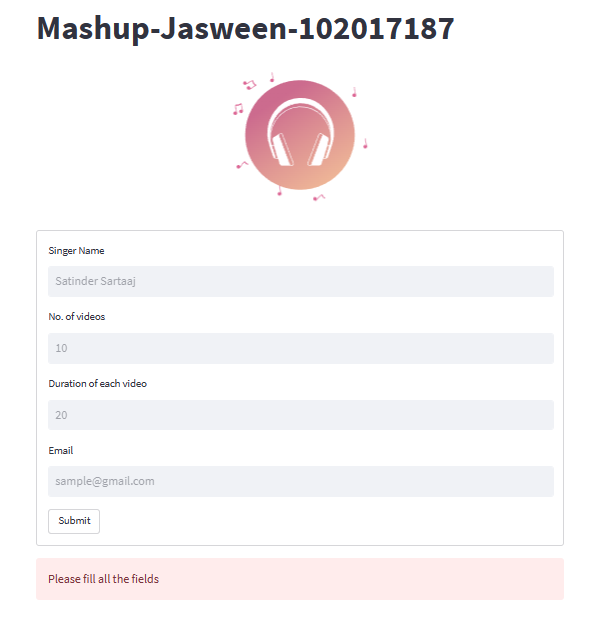

# PROJECT: MASHUP-WebApp

*😊😊😊 Show some :heart: by giving the repo a ⭐*

### 💠 An amazing web app made with streamlit 

### 💠 **Video Demonstration:**
   
   

### 💠 What does the website do ?

      🔹 Input: Enter name of singer, no. of videos, duration of each video, email address 
      
      🔹 Output: A mashup of n songs of the mentioned singer of the entered duration

### 💠 Tasks Performed:
    
    ⭐ Create a form to get inputs from user
    
    ⭐ Error Handling

    ⭐ Download N videos from YouTube
    
    ⭐ Convert the downloaded videos to audio
    
    ⭐ Clip y seconds from the audio and make shorter clips
     
    ⭐ Combine the shorter clips to crete output mashup file
    
    ⭐ Send the output mashup file through email

### 💠 Technologies Used

    ✔️ streamlit -> to create the web app
    
    ✔️ pytube  -> to search and download videos
    
    ✔️ moviepy -> to convert videos to audio and clip audios
    
    ✔️ pydub -> to merge audios
    
    ✔️ streamlit_lottie -> to add animation to web app
    
    ✔️ smtplib, email -> to send email

### 💠 **A glance of our web app:**
   
   

